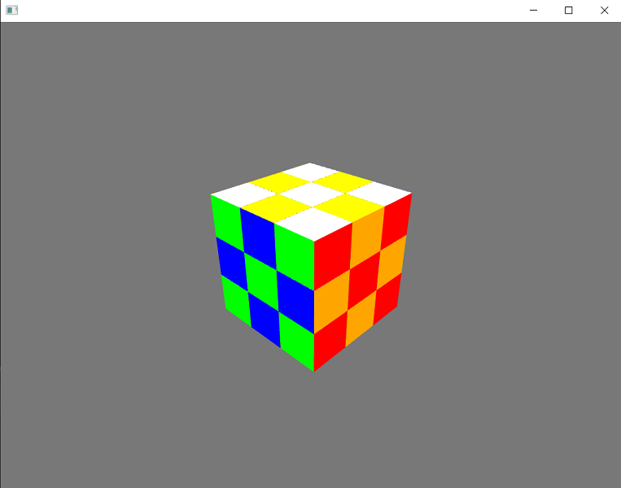

# Rubiks Cube visualisation

A Rubiks cube rendering built using the OpenFrameworks toolkit for C++. Each cube face can be controlled using the keyboard, and a file with a string of moves in cube notation can be added also. 
I hope to eventually include a solver, as well as the ability to render larger cubes. 

## Done 
* Cube rendering and basic face rotation 
* Animated face rotations
* Randomise cube function
* Ability to parse cube notation

## Todo
* CFOP based solver
* Abstaction for bigger NxN cubes

